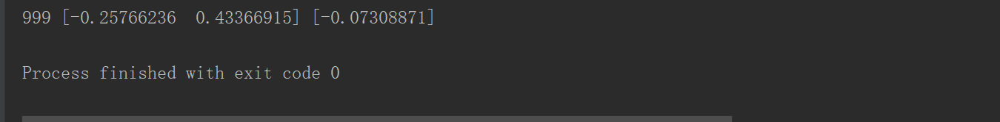
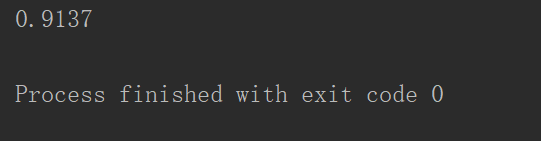

#以下算法在以后时间尽量会写详尽，尤其是其数学推导

### KNN

###### 介绍

K最近邻分类算法（K-Nearest Neihbor），是一个理论上比较成熟的算法，也是最简单的机器学习算法，主要思路：如果一个样品在特征空间k个最相似的样本中的大多数属于某一个类别，则该样本也属于这个类别。

###### 算法：

1.计算已知类别数据的点于当前点之间的距离

2.按照距离递增次序排序

3.选取与当前点距离最小的k个点

4.确定前k个点所在类别的概率

5.返回前k个点所出现的频率最高的类别作为当前点的预测分类

###### 欧几里得距离：

$$
d(p,q) = \sqrt{\sum_{i=1}^n(qi-pi)^2}
$$


###### 代码演示

```python
import numpy as np
import tensorflow as tf
import tensorflow.examples.tutorials.mnist.input_data as input_data
mnist = input_data.read_data_sets("MNIST_data/", one_hot=True)
#从MNIST数据集中筛选出5000条数据用作测试
train_X,train_Y = mnist.train.next_batch(5000)
#从MNIST数据集中筛选出200条数据用作测试
test_X,test_Y = mnist.test.next_batch(100)
train2_X = tf.placeholder("float",[None,784])
test2_X = tf.placeholder("float",[784])
#使用L1距离计算KNN距离计算
distance = tf.reduce_sum(tf.abs(tf.add(train2_X,tf.negative(test2_X))),reduction_indices=1)
#预测：取得最近的邻居节点
pred = tf.arg_min(distance,0)
accuracy = 0
#变量初始化
init = tf.global_variables_initializer()
#启动图
with tf.Session() as sess:
    sess.run(init)
    #遍历测试数据集
    for i in range(len(test_X)):
        #获取最近的邻居节点
        nn_index = sess.run(pred,feed_dict={train2_X:train_X,test2_X:test_X[i,:]})
        #获取最近的邻居节点的类别标签，并将其与该节点的真实类别标签进行比较
        print("测试数据",i,"预测分类:",np.argmax(train_Y[nn_index]),"真实类别:",np.argmax(test_Y[i]))
        #计算准确率
        if np.argmax(train_Y[nn_index]) == np.argmax(test_Y[i]):
            accuracy += 1./len(test_X)
    print("分类准确率为:",accuracy)
```


------

### Decising tree

###### 介绍：

决策树(Decision Tree）是在已知各种情况发生概率的[基础](https://baike.baidu.com/item/%E5%9F%BA%E7%A1%80/32794)上，通过构成决策树来求取净现值的[期望](https://baike.baidu.com/item/%E6%9C%9F%E6%9C%9B/35704)值大于等于零的概率，评价项目风险，判断其可行性的决策分析方法，是直观运用概率分析的一种图解法。由于这种决策分支画成图形很像一棵树的枝干，故称决策树。在机器学习中，决策树是一个预测模型，他代表的是对象属性与对象值之间的一种映射关系。Entropy= 系统的凌乱程度，使用算法[ID3](https://baike.baidu.com/item/ID3), [C4.5](https://baike.baidu.com/item/C4.5)和C5.0生成树算法使用熵。这一度量是基于信息学理论中熵的概念。分类树（决策树）是一种十分常用的分类方法。他是一种监管学习，所谓监管学习就是给定一堆样本，每个样本都有一组属性和一个类别，这些类别是事先确定的，那么通过学习得到一个分类器，这个分类器能够对新出现的对象给出正确的分类。这样的机器学习就被称之为监督学习。

##### 概念介绍：

###### 1.香农熵（entropy）：

 熵定义为信息的期望值。在信息论与概率统计中，熵是表示随机变量不确定性的度量。
$$
l(xi) = -log_2p(xi)
$$
p(xi)是选择该分类的概率

通过上式，可以计算所有类别的信息：
$$
H = -\sum_{i=1}^np(xi)log_2p(xi)
$$
n是分类数目，熵越大，随机变量的不确定性就越大

###### 2.信息增益：

如何选择特征，需要看信息增益。也就是说，信息增益是相对于特征而言的，信息增益越大，特征对最终的分类结果影响也就越大，我们就应该选择对最终分类结果影响最大的那个特征作为我们的分类特征。

明确一个概念，条件熵，条件熵H(Y|X)表示在已知随机变量X的条件下随机变量Y的不确定性，随机变量X给定的条件下随机变量Y的条件熵(conditional entropy) H(Y|X)，定义X给定条件下Y的条件概率分布的熵对X的数学期望：
$$
H（y|x） = \sum_{i=1}^np_iH(Y|X=x_i)
$$
特征A对训练数据集D的信息增益g(D,A)，定义为集合D的经验熵H(D)与特征A给定条件下D的经验条件熵H(D|A)之差，即
$$
g(D,A) = H(D)-H(D|A)
$$
即信息增益=经验熵 - 条件熵 

##### 算法：

决策树典型算法有ID3，C4.5，CART

此处介绍C4.5算法：

1.创建节点N

2.如果训练集为空，在节点N标记为Failure

3.如果训练集的所有记录都属于一个类别，则该类别标记节点N

4.如果候选属性为空，则返回N作为叶节点，标记为训练集中最普通的类

5.for each 候选属性 attribute_list

6.if 候选属性是连续的then

7.对该属性进行离散化

8.选择候选属性attribute_list中具有最高信息增益率的属性D

9.标记节点N为属性D

10.for each 属性D的一致值d

11.由[节点](https://baike.baidu.com/item/%E8%8A%82%E7%82%B9)N长出一个条件为D=d的分支

12.设s是训练集中D=d的训练样本的集合

13.if s为空

14.加上一个树叶，标记为训练集中最普通的类

15.else加上一个有C4.5（R - {D},C，s）返回的点

##### 代码演示：

```python
from sklearn.datasets import load_iris
from sklearn.tree import DecisionTreeClassifier
iris = load_iris()
print(iris)
iris_data=iris['data']
iris_lable = iris['target']
iris_target_name = iris['target_names']
clf = DecisionTreeClassifier(max_depth=3)
clf.fit(iris_data,iris_lable)
print('[7,7,7,7]预测类别是',iris_target_name[clf.predict([[7,7,7,7]])])
```


------

### SVM(支持向量机)

##### SVM介绍：

支持向量机（Support Vector Machine, SVM）是一类按[监督学习](https://baike.baidu.com/item/%E7%9B%91%E7%9D%A3%E5%AD%A6%E4%B9%A0/9820109)（supervised learning）方式对数据进行[二元分类](https://baike.baidu.com/item/%E4%BA%8C%E5%85%83%E5%88%86%E7%B1%BB/15635322)（binary classification）的广义线性分类器（generalized linear classifier），其[决策边界](https://baike.baidu.com/item/%E5%86%B3%E7%AD%96%E8%BE%B9%E7%95%8C/22778546)是对学习样本求解的最大边距超平面（maximum-margin hyperplane。SVM使用铰链损失函数（hinge loss）计算经验风险（empirical risk）并在求解系统中加入了正则化项以优化结构风险（structural risk），是一个具有稀疏性和稳健性的分类器 。SVM可以通过[核方法](https://baike.baidu.com/item/%E6%A0%B8%E6%96%B9%E6%B3%95/1683712)（kernel method）进行非线性分类，是常见的核学习（kernel learning）方法之一 。SVM被提出于1963年，在二十世纪90年代后得到快速发展并衍生出一系列改进和扩展算法，包括多分类SVM、最小二乘SVM（Least-Square SVM, LS-SVM）、支持向量回归（Support Vector Regression, SVR），支持向量聚类（support vector clustering）、半监督SVM（semi-supervised SVM, S3VM）等，在人像识别（face recognition）、文本分类（text categorization）等模式识别（pattern recognition）问题中有广泛应用。

###### 线性可分(linear separability)：

分类问题中给定输入数据和学习目标X={x1，x2...xn},y={y1,y2...yn},输入样品拥有多个特征，在几何上构成了特征空间（feature space）：X={x1...xn},Y={1-,1},即negative class和positive class。如果输入数据所在的特征空间存在决策边界（decision boundary）的超平面（hyperplane）：
$$
W^{T}+b=0
$$
将学习目标按照正负分类，并使任意样品到平面距离大于1：
$$
y_i(w^{T}X_i+b)>=1
$$
 则称该分类问题是具有线性可分性，w和b分别为超平面法向量和截距。

满足该条件的决策边界实际上构造了2个平行的超平面：
$$
w^{T}X_i+b-1>=+1,if y_i=+1
\\
w^{T}X_i+b-1<=+1,if y_i=-1
$$
两个间隔边距的距离：
$$
d=2/||w||
$$


###### 损失函数（loss function）：

在不具有线性可分性时，使用超平面作为决策边界会带来分类损失，即数据不再支持向量上，而是进入了间隔边界的内部，或者错误落入决策边界的一边。

损失函数可以对分类损失进行向量化：
$$
L(p)=\begin{cases}
0 & p<0 \\
1 & p>=0  \\
\end{cases}
$$

###### 其他损失函数：

###### hinge：

$$
L（p）=max(0,1,-p)
$$

###### logistic:

$$
L（P）=log[1+exp(-p)]
$$

###### exponential:

$$
L(p)=exp(-p)
$$


###### 核方法：

一些线性不可分的问题可能时可分的，即特征空间存在超曲面（hypersurface）。使用非线性函数可以将非线性可分问题从原始的特征空间映射至更高维的希尔伯特空间H（Hilbert space）：
$$
w^{T}\phi(X)+b=0
$$

$$
\phi:x->H的映射函数
$$

###### 核函数：

$$
k(X_1,X_2)=\phi(X_1)^{T}\phi(X_2)
$$


###### 代码：

```python
import matplotlib.pyplot as plt
import numpy as np
import tensorflow as tf
from sklearn import datasets

sess = tf.Session()

# 加载数据
# iris.data = [(Sepal Length, Sepal Width, Petal Length, Petal Width)]
iris = datasets.load_iris()
x_vals = np.array([[x[0], x[3]] for x in iris.data])
y_vals = np.array([1 if y == 0 else -1 for y in iris.target])
# 分离训练和测试集
train_indices = np.random.choice(len(x_vals),
                                 round(len(x_vals)*0.8),
                                 replace=False)
test_indices = np.array(list(set(range(len(x_vals))) - set(train_indices)))
x_vals_train = x_vals[train_indices]
x_vals_test = x_vals[test_indices]
y_vals_train = y_vals[train_indices]
y_vals_test = y_vals[test_indices]
batch_size = 100

# 初始化feedin
x_data = tf.placeholder(shape=[None, 2], dtype=tf.float32)
y_target = tf.placeholder(shape=[None, 1], dtype=tf.float32)

# 创建变量
A = tf.Variable(tf.random_normal(shape=[2, 1]))
b = tf.Variable(tf.random_normal(shape=[1, 1]))

# 定义线性模型
model_output = tf.subtract(tf.matmul(x_data, A), b)

# Declare vector L2 'norm' function squared
l2_norm = tf.reduce_sum(tf.square(A))

# Loss = max(0, 1-pred*actual) + alpha * L2_norm(A)^2
alpha = tf.constant([0.01])
classification_term = tf.reduce_mean(tf.maximum(0., tf.subtract(1., tf.multiply(model_output, y_target))))
loss = tf.add(classification_term, tf.multiply(alpha, l2_norm))
my_opt = tf.train.GradientDescentOptimizer(0.01)
train_step = my_opt.minimize(loss)

init = tf.global_variables_initializer()
sess.run(init)

# Training loop
loss_vec = []
train_accuracy = []
test_accuracy = []
for i in range(20000):
    rand_index = np.random.choice(len(x_vals_train), size=batch_size)
    rand_x = x_vals_train[rand_index]
    rand_y = np.transpose([y_vals_train[rand_index]])
    sess.run(train_step, feed_dict={x_data: rand_x, y_target: rand_y})
[[a1], [a2]] = sess.run(A)
[[b]] = sess.run(b)
slope = -a2/a1
y_intercept = b/a1
best_fit = []

x1_vals = [d[1] for d in x_vals]

for i in x1_vals:
    best_fit.append(slope*i+y_intercept)


# Separate I. setosa
setosa_x = [d[1] for i, d in enumerate(x_vals) if y_vals[i] == 1]
setosa_y = [d[0] for i, d in enumerate(x_vals) if y_vals[i] == 1]
not_setosa_x = [d[1] for i, d in enumerate(x_vals) if y_vals[i] == -1]
not_setosa_y = [d[0] for i, d in enumerate(x_vals) if y_vals[i] == -1]

plt.plot(setosa_x, setosa_y, 'o', label='I. setosa')
plt.plot(not_setosa_x, not_setosa_y, 'x', label='Non-setosa')
plt.plot(x1_vals, best_fit, 'r-', label='Linear Separator', linewidth=3)
plt.ylim([0, 10])
plt.legend(loc='lower right')
plt.title('Sepal Length vs Pedal Width')
plt.xlabel('Pedal Width')
plt.ylabel('Sepal Length')
plt.show()
```


------

### 朴素贝叶斯

###### 介绍：

朴素贝叶斯法是基于贝叶斯定理与特征条件独立假设的分类方法 [1]  。最为广泛的两种分类模型是决策树模型(Decision Tree Model)和朴素贝叶斯模型（Naive Bayesian Model，NBM）。和决策树模型相比，**朴素贝叶斯分类器(Naive Bayes Classifier,或 NBC)**发源于古典数学理论，有着坚实的数学基础，以及稳定的分类效率。同时，NBC模型所需估计的参数很少，对缺失数据不太敏感，算法也比较简单。理论上，NBC模型与其他分类方法相比具有最小的误差率。但是实际上并非总是如此，这是因为NBC模型假设属性之间相互独立，这个假设在实际应用中往往是不成立的，这给NBC模型的正确分类带来了一定影响。

###### 贝叶斯：

$$
P(A|B)=P(A){P(B|A)/P(B)}
$$

P(A)是先验概率

P(A|B)是后验概率

P(B|A)/P(B)是可能性函数
$$
后验概率 = 先验概率*可能性函数
$$

###### 朴素贝叶斯：

朴素贝叶斯对条件概率分布做了条件独立性的假设。

###### 代码演示：

```python
from numpy import *

def loadDataSet():
    postingList=[['my', 'dog', 'has', 'flea', 'problems', 'help', 'please'],
                 ['maybe', 'not', 'take', 'him', 'to', 'dog', 'park', 'stupid'],
                 ['my', 'dalmation', 'is', 'so', 'cute', 'I', 'love', 'him'],
                 ['stop', 'posting', 'stupid', 'worthless', 'garbage'],
                 ['mr', 'licks', 'ate', 'my', 'steak', 'how', 'to', 'stop', 'him'],
                 ['quit', 'buying', 'worthless', 'dog', 'food', 'stupid']]
    classVec = [0,1,0,1,0,1]
    return postingList,classVec
def createVocabList(dataSet):
    vocabSet = set([])
    for document in dataSet:
        vocabSet = vocabSet | set(document)
    return list(vocabSet)
def setOfWords2Vec(vocabList, inputSet):
    returnVec = [0]*len(vocabList)
    for word in inputSet:
        if word in vocabList:
            returnVec[vocabList.index(word)] = 1
        else: print("the word: %s is not in my Vocabulary!" % word)
    return returnVec
def trainNB0(trainMatrix,trainCategory):
    numTrainDocs = len(trainMatrix)
    numWords = len(trainMatrix[0])
    pAbusive = sum(trainCategory)/float(numTrainDocs)
    p0Num = ones(numWords); p1Num = ones(numWords)
    p0Denom = 2.0; p1Denom = 2.0
    for i in range(numTrainDocs):
        if trainCategory[i] == 1:
            p1Num += trainMatrix[i]
            p1Denom += sum(trainMatrix[i])
        else:
            p0Num += trainMatrix[i]
            p0Denom += sum(trainMatrix[i])
    p1Vect = log(p1Num/p1Denom)
    p0Vect = log(p0Num/p0Denom)

    return p0Vect,p1Vect,pAbusive
def classifyNB(vec2Classify, p0Vec, p1Vec, pClass1):
    p1 = sum(vec2Classify * p1Vec) + log(pClass1)
    p0 = sum(vec2Classify * p0Vec) + log(1.0 - pClass1)
    if p1 > p0:
        return 1
    else:
        return 0
def testingNB():
    listOPosts,listClasses = loadDataSet()
    myVocabList = createVocabList(listOPosts)
    trainMat=[]
    for postinDoc in listOPosts:
        trainMat.append(setOfWords2Vec(myVocabList, postinDoc))
    p0V,p1V,pAb = trainNB0(array(trainMat),array(listClasses))
    testEntry = ['love', 'my', 'dalmation']
    thisDoc = array(setOfWords2Vec(myVocabList, testEntry))
    print(testEntry,'classified as: ',classifyNB(thisDoc,p0V,p1V,pAb))
    testEntry = ['stupid', 'garbage']
    thisDoc = array(setOfWords2Vec(myVocabList, testEntry))
    print(testEntry,'classified as: ',classifyNB(thisDoc,p0V,p1V,pAb))
if __name__ == '__main__':
    testingNB()
```


------

### logistic

###### 介绍：

logistic回归是一种广义线性回归（generalized linear model），因此与多重线性回归分析有很多相同之处。它们的模型形式基本上相同，都具有 w‘x+b，其中w和b是待求参数，其区别在于他们的因变量]不同，多重线性回归直接将w‘x+b作为因变量，即y  =w‘x+b，而logistic回归则通过函数L将w‘x+b对应一个隐状态p，p =L(w‘x+b),然后根据p  与1-p的大小决定因变量的值。如果L是logistic函数，就是logistic回归，如果L是多项式函数就是多项式回归。logistic回归的因变量可以是二分类的，也可以是多分类的，但是二分类的更为常用，也更加容易解释，多类可以使用softmax方法进行处理。实际中最为常用的就是二分类的logistic回归。

###### sigmoid:


z是一个矩阵，θ是参数列向量(要求解的)，x是样本列向量(给定的数据集)。θ^T表示θ的转置。g(z)函数实现了任意实数到[0,1]的映射，这样我们的数据集([x0,x1,…,xn])，不管是大于1或者小于0，都可以映射到[0,1]区间进行分类。hθ(x)给出了输出为1的概率。

我们可以在每个特征上都乘上一个回归系数，然后把所有的结果值相加，将这个总代数和代入sigmoid函数，进而得到一个0~1之间的数值，任何大于0.5的数据分入1类，小于0.5的分入2类。

所以主要问题是确定回归系数！

###### 回归系数的缺点：

sigmoid输入记为z=w0x0+w1x1+w2x2...+wnxn
$$
z=w_{0}x_{0}+w_{1}x_{1}+w_{2}x_{2}...+w_{n}x_{n}
$$
寻找最佳系数w向量。

###### 梯度上升：

###### 思想：

要找到某函数的最大值，最好的方法是沿着这个函数的梯度 方向寻找：
$$
\delta(x,y)=\begin{cases}
\rho f(x,y)/_{\rho_x}\\
f(x,y)/_{\rho_x}\\
\end{cases}
$$
要求f(x,y)在待计算的点有意义且可微。梯度算子总是会沿着函数值增加最快的方向移动，其中移动的大小即为步长，记为阿尔法

则梯度上升的迭代公式为：
$$
w:=w+\alpha \delta_{w}f(w)
$$
梯度下降，和梯度上升差不多，其迭代公式为：
$$
w:=w-\alpha \delta_{w}f(w)
$$

###### logistic回归的一般过程:

1. 收集数据（采用任意方法）
2. 准备书籍，结构化数据，且为整数，方便与距离计算
3. 分析数据（采用任意方法）
4. 训练算法，寻找最佳系数
5. 测试算法，测试分类
6. 使用算法：输入数据，转化为结构化的数据，接着用基于最佳回归系数进行回归计算并分类

###### 代码演示：

```
import tensorflow as tf
from numpy import *
x_train = [[1.0, 2.0], [2.0, 1.0], [2.0, 3.0], [3.0, 5.0], [1.0, 3.0], [4.0, 2.0], [7.0, 3.0], [4.0, 5.0], [11.0, 3.0], [8.0, 7.0]]
y_train = [1, 1, 0, 1, 0, 1, 0, 1, 0, 1]
#调用mat( )函数可以将数组转化为矩阵
y_train = mat(y_train)
theta = tf.Variable(tf.zeros([2, 1]))
theta0 = tf.Variable(tf.zeros([1, 1]))
y = 1 / (1 + tf.exp(-tf.matmul(x_train, theta) + theta0))
#损失函数，均方误差
loss = tf.reduce_mean(- y_train.reshape(-1, 1) * tf.log(y) - (1 - y_train.reshape(-1, 1)) * tf.log(1 - y))
#梯度下降减小loss
train = tf.train.GradientDescentOptimizer(0.01).minimize(loss)
#初始化
init = tf.initialize_all_variables()
sess = tf.Session()
sess.run(init)
for step in range(1000):
    sess.run(train)
#flatten()函数功能是把多维数组降为一维
print(step, sess.run(theta).flatten(), sess.run(theta0).flatten())
```



------

### AdaBoost

###### 介绍：

Adaboost是一种迭代算法，其核心思想是针对同一个训练集训练不同的分类器(弱分类器)，然后把这些弱分类器集合起来，构成一个更强的最终分类器(强分类器)。其算法本身是通过改变数据分布来实现的，它根据每次训练集之中每个样本的分类是否正确，以及上次的总体分类的准确率，来确定每个样本的权值。将修改过权值的新数据集送给下层分类器进行训练，最后将每次训练得到的分类器最后融合起来，作为最后的决策分类器。使用adaboost分类器可以排除一些不必要的训练数据特征，并放在关键的训练数据上面。

###### 集成方法（ensemble）&元算法（meta-algorithm）：

即把多种分类器结合在一起，结合的方式有多种：可以是不同算法的结合，也可以是同一算法在不同的设置下的集成

```
AdaBoost
优点：泛化错误率低，易编码，可以应用大部分分类器，无参数调整
缺点：对离群点敏感
适用数据类型：数值型和标称型数据
```

###### bagging：

自举汇聚法（boostrap aggregating）：从原始数据选择S次后得到S个新数据集的技术，新数据和原数据大小相等，在S个数据建立好之后，将某个学习算法作用于每个数据集就得到S个分类器

###### boosting：

boosting和bagging很相似，使用的分类器都是一样的，但前者不同的分类器是通过串行训练获得的，每个新分类器都根据自己训练出的分类器性能进行训练。boosting是通过集中关注已有分类器错分的那些数据来获得新的分类器。

boosting分类结果是基于所有分类器的加权求和结果的，而bagging的权重是一样的。

###### AdaBoost一般流程：

1. 收集数据

2. 准备数据，依赖于所使用的弱分类器

3. 分析数据

4. 训练算法

5. 测试算法，计算分类的错误率

6. 使用算法

   ###### 训练算法：基于错误提升分类器的性能：

   ###### AdaBoost（adaptive boosting）自适应boosting：

   训练数据中的每个样品，赋予其一个权重，刚开始，这些权重初始化为相等的，这些权重构成了一个向量D，首先在这些数据集中训练出一个弱分类器，并计算出错误率，然后在同一数据集上再次训练弱分类器，在第二次训练，会调整权重，为了从所有弱分类器得到分类结果，Adaboost为每个分类器分配了一个权重值alpha，这些alpha值基于每个分类器错误率计算得到的。
   $$
   错误率：
   \epsilon=未正确分类的样本数目/所有样本数目
   $$


alpha计算公式：
$$
\alpha = (1/2)ln{(1-\epsilon)/\epsilon}
$$

计算出alpha后，更新权重向量D

D的计算方式：
$$
D_{i}^{t+1}=D_{i}^{t}e^{-a}/sum(D)
$$
如果错分，则更新为：
$$
D_{i}^{t+1}=D_{i}^{t}e^{a}/sum(D)
$$
代码演示

```
import numpy as np
import matplotlib.pyplot as plt
from sklearn.ensemble import AdaBoostClassifier
from sklearn.tree import DecisionTreeClassifier
from sklearn.datasets import make_gaussian_quantiles
#用make_gaussian_quantiles生成多组多维正态分布的数据
#这里生成2维正态分布，设定样本数1000，协方差2
x1,y1=make_gaussian_quantiles(cov=2., n_samples=200, n_features=2, n_classes=2, shuffle=True, random_state=1)
#为了增加样本分布的复杂度，再生成一个数据分布
x2,y2=make_gaussian_quantiles(mean=(3,3), cov=1.5, n_samples=300, n_features=2, n_classes=2, shuffle=True, random_state=1)
#合并
X=np.vstack((x1,x2))
y=np.hstack((y1,1-y2))
#plt.scatter(X[:,0],X[:,1],c=Y)
#plt.show()
#设定弱分类器CART
weakClassifier=DecisionTreeClassifier(max_depth=1)
#构建模型。
clf=AdaBoostClassifier(base_estimator=weakClassifier,algorithm='SAMME',n_estimators=300,learning_rate=0.8)
clf.fit(X, y)
#绘制分类效果
x1_min=X[:,0].min()-1
x1_max=X[:,0].max()+1
x2_min=X[:,1].min()-1
x2_max=X[:,1].max()+1
x1_,x2_=np.meshgrid(np.arange(x1_min,x1_max,0.02),np.arange(x2_min,x2_max,0.02))
y_=clf.predict(np.c_[x1_.ravel(),x2_.ravel()])
y_=y_.reshape(x1_.shape)
plt.contourf(x1_,x2_,y_,cmap=plt.cm.Paired)
plt.scatter(X[:,0],X[:,1],c=y)
plt.show()
```


------

### CART（classification and regression tree）

###### 介绍：

CART算法是一种二分递归分割技术，把当前样本划分为两个子样本，使得生成的每个非叶子结点都有两个分支，因此CART算法生成的决策树是结构简洁的二叉树。由于CART算法构成的是一个二叉树，它在每一步的决策时只能   是“是”或者“否”，即使一个feature有多个取值，也是把数据分为两部分。

###### 算法：

###### 其中T代表当前样本集，当前候选属性集用T_attributelist表示

1. 创建根节点N

2. 为N分配类别

3. if T 都属于同一类别or T中只剩下 一个样本则返回N为叶节点，否则为其分配属性

4. for each T_attributelist中属性执行该属性上的一个划分，计算此划分的GINI系数

5. N的测试属性test_attribute=T_attributelist中最小GINI系数的属性

6. 划分T得到T1 T2子集

7. 对于T1重复（1）-（6）

8. 对于T2重复（1）-（6）

   ###### Gini：

   $$
   Gini(A) = 1-\sum_{i=1}^{C}p_{i}^{2}
   $$

   其中pi表示属于第i类的概率，当Gini(A)=0时，所有样本属于同类，所有类在节点中以等概率出现时，Gini(A)最大化，此时
   $$
   C(C-1)/2
   $$
   pi 有了上述理论基础，实际的递归划分过程是这样的：如果当前节点的所有样本都不属于同一类或者只剩下一个样本，那么此节点为非叶子节点，所以会尝试样本的每个属性以及每个属性对应的分裂点，尝试找到杂质变量最大的一个划分，该属性划分的子树即为最优分支。

   ###### 代码演示：

   ```
   #待定
   ```

   ### CNN

   ###### 介绍：

   卷积神经网络，听起来像是计算机科学、生物学和数学的诡异组合，但它们已经成为计算机视觉领域中最具影响力的革新的一部分。神经网络在 2012 年崭露头角，Alex Krizhevsky 凭借它们赢得了那一年的 ImageNet 挑战赛（大体上相当于计算机视觉的年度奥林匹克），他把分类误差记录从 26% 降到了 15%，在当时震惊了世界。自那之后，大量公司开始将深度学习用作服务的核心。Facebook 将神经网络用于自动标注算法、谷歌将它用于图片搜索、亚马逊将它用于商品推荐、Pinterest 将它用于个性化主页推送、Instagram 将它用于搜索架构。

   #### 框架搭建步骤:

   ###### 1.前向传播:

   ```python
   def forward(x,regularizer):
   	w=
   	b=
   	y=
   	return y
   def get_weight(shape,regularizer):
   	tf.add_to_collection('losses',tf.contrib.layers.l2_regularizer(regularizer)(w)) 
   	return w
   def get_bias(shape):
   	b = tf.Variable()
   	return b
   ```

   ###### 2.反向传播：

   ```python
   def backward():
   	x = tf.placeholder(    ) 
   	y_ = tf.placeholder(    ) 
   	y = forward.forward(x, REGULARIZER) 
   	global_step = tf.Variable(0, trainable=False)   
   	loss =   
   ```

   ###### 3.正则化：

   ```python
   #MSE
   loss_mse = tf.reduce_mean(tf.square(y-y_))
   #交叉熵
   ce = tf.nn.sparse_softmax_cross_entropy_with_logits(logits=y, labels=tf.argmax(y_, 1))
   #损失加上正则化
   loss = y 与 y_的差距 + tf.add_n(tf.get_collection('losses'))  
   #指数衰减
   learning_rate = tf.train.exponential_decay( 
    LEARNING_RATE_BASE,   
    global_step,        
    数据集总样本数 / BATCH_SIZE, 
           LEARNING_RATE_DECAY,
           staircase=True)     
   train_step=tf.train.GradientDescentOptimizer(learning_rate).minimize(loss,global_step=global_step)
   #滑动平均
   ema = tf.train.ExponentialMovingAverage(MOVING_AVERAGE_DECAY, global_step)     
   ema_op = ema.apply(tf.trainable_variables())     
   with tf.control_dependencies([train_step, ema_op]):         
    train_op = tf.no_op(name='train')
   #初始化参数
   with tf.Session() as sess:         
    init_op = tf.global_variables_initializer() 
          sess.run(init_op) 
    for i in range(STEPS): 
        sess.run(train_step, feed_dict={x:   , y_:   }) 
               if i % 轮数 == 0: 
               print
   ```

   ```python
   #MSE
   loss_mse = tf.reduce_mean(tf.square(y-y_))
   #交叉熵
   ce = tf.nn.sparse_softmax_cross_entropy_with_logits(logits=y, labels=tf.argmax(y_, 1))
   #损失加上正则化
   loss = y 与 y_的差距 + tf.add_n(tf.get_collection('losses'))  
   #指数衰减
   learning_rate = tf.train.exponential_decay( 
    LEARNING_RATE_BASE,   
    global_step,        
    数据集总样本数 / BATCH_SIZE, 
           LEARNING_RATE_DECAY,
           staircase=True)     
   train_step=tf.train.GradientDescentOptimizer(learning_rate).minimize(loss,global_step=global_step)
   #滑动平均
   ema = tf.train.ExponentialMovingAverage(MOVING_AVERAGE_DECAY, global_step)     
   ema_op = ema.apply(tf.trainable_variables())     
   with tf.control_dependencies([train_step, ema_op]):         
    train_op = tf.no_op(name='train')
   #初始化参数
   with tf.Session() as sess:         
    init_op = tf.global_variables_initializer() 
          sess.run(init_op) 
    for i in range(STEPS): 
        sess.run(train_step, feed_dict={x:   , y_:   }) 
               if i % 轮数 == 0: 
               print
   ```

   [tensorflow详细](https://github.com/verylazycat/tensorflow-)

   

   ###### 相关数学知识：

   ###### 感知机：

   

   数学模型：
   $$
    f(x)=action(\theta^{T}+b)
   $$
   其中action为激活函数，可以是sigmoid，relu，tanh，还有一个特殊的激活函数softmax

   

   ###### sigmoid：

   $$
   \sigma = 1/{1+e^{-x}}
   $$

   

   目前很少用sigmoid了。

   - *Sigmoid函数饱和使梯度消失*。当神经元的激活在接近0或1处时会饱和，在这些区域梯度几乎为0，这就会导致梯度消失，几乎就有没有信号通过神经传回上一层。

   - *Sigmoid函数的输出不是零中心的*。因为如果输入神经元的数据总是正数，那么关于w的梯度在反向传播的过程中，将会要么全部是正数，要么全部是负数，这将会导致梯度下降权重更新时出现z字型的下降。

     ###### tanh：

     $$
     tanh(x)=2{\sigma}(2x)-1
     $$

     

   Tanh解决了Sigmoid的输出是不是零中心的问题，但仍然存在饱和问题。为了防止饱和，现在主流的做法会在激活函数前多做一步batch normalization，尽可能保证每一层网络的输入具有均值较小的、零中心的分布。

   ###### relu：

   $$
   f(x)=max(0,x)
   $$

   

   相较于sigmoid和tanh函数，ReLU对于随机梯度下降的收敛有巨大的加速作用；sigmoid和tanh在求导时含有指数运算，而ReLU求导几乎不存在任何计算量

   ###### 代码：

   ```python
   #导入tensorflow
   import tensorflow as tf
   #导入数据
   import tensorflow.examples.tutorials.mnist.input_data as input_data
   mnist = input_data.read_data_sets("MNIST_data/", one_hot=True)
   #定义喂入数据
   x = tf.placeholder("float", [None, 784])
   #定义权重
   #定义偏置
   W = tf.Variable(tf.zeros([784,10]))
   b = tf.Variable(tf.zeros([10]))
   #预测值
   y = tf.nn.softmax(tf.matmul(x,W) + b)
   #真实值
   y_ = tf.placeholder("float", [None,10])
   #交叉熵计算
   cross_entropy = -tf.reduce_sum(y_*tf.log(y))
   #梯度下降
   train_step = tf.train.GradientDescentOptimizer(0.01).minimize(cross_entropy)
   #初始化
   init = tf.initialize_all_variables()
   sess = tf.Session()
   sess.run(init)
   for i in range(1000):
       batch_xs, batch_ys = mnist.train.next_batch(100)
       sess.run(train_step, feed_dict={x: batch_xs, y_: batch_ys})
   #返回布尔类型，需要转化为float
   correct_prediction = tf.equal(tf.argmax(y,1), tf.argmax(y_,1))
   accuracy = tf.reduce_mean(tf.cast(correct_prediction, "float"))
   print(sess.run(accuracy, feed_dict={x: mnist.test.images, y_: mnist.test.labels}))
   ```

   

   因此CART算法生成的决策树是结构简洁的二叉树。由于CART算法构成的是一个二叉树，它在每一步的决策时只能

   是“是”或者“否”，即使一个feature有多个取值，也是把数据分为两部分

---------------------

### RNN

介绍：

循环神经网络，**Recurrent Neural Network**。神经网络是一种节点定向连接成环的人工神经网络。这种网络的内部状态可以展示动态时序行为。不同于前馈神经网络的是，RNN可以利用它内部的记忆来处理任意时序的输入序列，这让它可以更容易处理如不分段的手写识别、语音识别等。神经网络专家如Jordan，Pineda．Williams，Elman等于上世纪80年代末提出的一种神经网络结构模型。即循环神经网络(Recurrent Neural Network，RNN)。这种网络的本质特征是在处理单元之间既有内部的反馈连接又有前馈连接。从系统观点看，它是一个反馈动力系统，在计算过程中体现过程动态特性，比前馈神经网络具有更强的动态行为和计算能力。循环神经网络现已成为国际上神经网络专家研究的重要对象之一。不同于传统的FNNs(Feed-forward Neural Networks，前向反馈神经网络)，RNNs引入了定向循环，能够处理那些输入之间前后关联的问题。


###### RNNS:

RNNs的目的使用来处理序列数据。在传统的神经网络模型中，是从输入层到隐含层再到输出层，层与层之间是全连接的，每层之间的节点是无连接的。但是这种普通的神经网络对于很多问题却无能无力.例如，你要预测句子的下一个单词是什么，一般需要用到前面的单词，因为一个句子中前后单词并不是独立的。


上面这幅图中展示了一个RNN展开成为一个完整的神经网路的过程，一个最简单的展开方式就是，输入序列中有多少个状态，就将隐藏层展开多少次。比如，前面提到的步态识别中，将步态序列归一化成为10个状态，那么一个简单的RNN展开后，就可以在隐藏层展开出10层，并且，每个步态状态对应于展开出来的一个隐藏层。

RNN计算流程：

- xt是输入序列在  时刻的输入向量

- st是在  时刻隐藏层的输出，这是RNN的记忆单元，st的计算基于前一次隐藏层计算的输出 s（t-1）以及当前的输入xt

- ot是步骤t时刻得输出

  ###### ######RNN里面得算法有好几个，以后继续补充#####

  ###### 代码演示：

  ```
  import copy, numpy as np
  np.random.seed(0)
  
  # compute sigmoid nonlinearity
  def sigmoid(x):
      output = 1/(1+np.exp(-x))
      return output
  
  # convert output of sigmoid function to its derivative
  def sigmoid_output_to_derivative(output):
      return output*(1-output)
  
  # training dataset generation
  int2binary = {}
  binary_dim = 8
  
  largest_number = pow(2,binary_dim)
  binary = np.unpackbits(
      np.array([range(largest_number)],dtype=np.uint8).T,axis=1)
  for i in range(largest_number):
      int2binary[i] = binary[i]
  
  # input variables
  alpha = 0.1
  input_dim = 2
  hidden_dim = 16
  output_dim = 1
  
  # initialize neural network weights
  synapse_0 = 2*np.random.random((input_dim,hidden_dim)) - 1
  synapse_1 = 2*np.random.random((hidden_dim,output_dim)) - 1
  synapse_h = 2*np.random.random((hidden_dim,hidden_dim)) - 1
  
  synapse_0_update = np.zeros_like(synapse_0)
  synapse_1_update = np.zeros_like(synapse_1)
  synapse_h_update = np.zeros_like(synapse_h)
  
  # training logic
  for j in range(10000):
  
      # generate a simple addition problem (a + b = c)
      a_int = np.random.randint(largest_number/2) # int version
      a = int2binary[a_int] # binary encoding
  
      b_int = np.random.randint(largest_number/2) # int version
      b = int2binary[b_int] # binary encoding
  
      # true answer
      c_int = a_int + b_int
      c = int2binary[c_int]
  
      # where we'll store our best guess (binary encoded)
      d = np.zeros_like(c)
  
      overallError = 0
  
      layer_2_deltas = list()
      layer_1_values = list()
      layer_1_values.append(np.zeros(hidden_dim))
  
      # moving along the positions in the binary encoding
      for position in range(binary_dim):
  
          # generate input and output
          X = np.array([[a[binary_dim - position - 1],b[binary_dim - position - 1]]])
          y = np.array([[c[binary_dim - position - 1]]]).T
  
          # hidden layer (input ~+ prev_hidden)
          layer_1 = sigmoid(np.dot(X,synapse_0) + np.dot(layer_1_values[-1],synapse_h))
  
          # output layer (new binary representation)
          layer_2 = sigmoid(np.dot(layer_1,synapse_1))
  
          # did we miss?... if so by how much?
          layer_2_error = y - layer_2
          layer_2_deltas.append((layer_2_error)*sigmoid_output_to_derivative(layer_2))
          overallError += np.abs(layer_2_error[0])
  
          # decode estimate so we can print it out
          d[binary_dim - position - 1] = np.round(layer_2[0][0])
  
          # store hidden layer so we can use it in the next timestep
          layer_1_values.append(copy.deepcopy(layer_1))
  
      future_layer_1_delta = np.zeros(hidden_dim)
  
      for position in range(binary_dim):
  
          X = np.array([[a[position],b[position]]])
          layer_1 = layer_1_values[-position-1]
          prev_layer_1 = layer_1_values[-position-2]
  
          # error at output layer
          layer_2_delta = layer_2_deltas[-position-1]
          # error at hidden layer
          layer_1_delta = (future_layer_1_delta.dot(synapse_h.T) +
              layer_2_delta.dot(synapse_1.T)) * sigmoid_output_to_derivative(layer_1)
          # let's update all our weights so we can try again
          synapse_1_update += np.atleast_2d(layer_1).T.dot(layer_2_delta)
          synapse_h_update += np.atleast_2d(prev_layer_1).T.dot(layer_1_delta)
          synapse_0_update += X.T.dot(layer_1_delta)
  
          future_layer_1_delta = layer_1_delta
  
      synapse_0 += synapse_0_update * alpha
      synapse_1 += synapse_1_update * alpha
      synapse_h += synapse_h_update * alpha
  
      synapse_0_update *= 0
      synapse_1_update *= 0
      synapse_h_update *= 0
  
      # print out progress
      if(j % 1000 == 0):
          print("Error:" + str(overallError))
          print("Pred:" + str(d))
          print("True:" + str(c))
          out = 0
          for index,x in enumerate(reversed(d)):
              out += x*pow(2,index)
          print(str(a_int) + " + " + str(b_int) + " = " + str(out))
          print ("------------")
  ```

  

------

### PCA